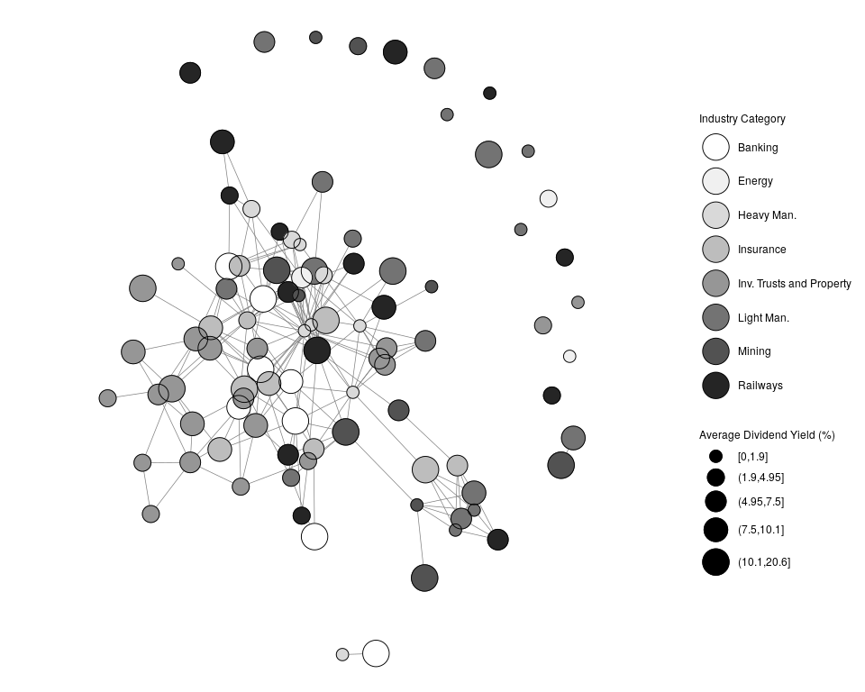

Materials for Reproduction
--------------------------

This repository contains the data and code to reproduce the tables and
figures in Rui Esteves and Gabriel Geisler Mesevage, “Social Networks in
Economic History: Opportunities and Challenges.” This document is
designed to be self-contained. Researchers can clone this repository and
open the `.Rmd` file to follow the production of the tables and figures
interactively. Alternatively, the file `scotland_eda.R` is a stand-alone
file with R-code that produces each figure and table contained in the
paper.

In the sections below, we include a more interactive code through for
the production of the tables and figures.

### Loading the data and network summary statistics

``` r
library(Hmisc)
```

    ## Loading required package: lattice

    ## Loading required package: survival

    ## Loading required package: Formula

    ## Loading required package: ggplot2

    ## 
    ## Attaching package: 'Hmisc'

    ## The following objects are masked from 'package:base':
    ## 
    ##     format.pval, units

``` r
library(tidyverse)
```

    ## ── Attaching packages ────────────────────── tidyverse 1.2.1 ──

    ## ✔ tibble  2.1.3     ✔ purrr   0.3.2
    ## ✔ tidyr   0.8.3     ✔ dplyr   0.8.3
    ## ✔ readr   1.3.1     ✔ stringr 1.4.0
    ## ✔ tibble  2.1.3     ✔ forcats 0.4.0

    ## ── Conflicts ───────────────────────── tidyverse_conflicts() ──
    ## ✖ dplyr::filter()    masks stats::filter()
    ## ✖ dplyr::lag()       masks stats::lag()
    ## ✖ dplyr::src()       masks Hmisc::src()
    ## ✖ dplyr::summarize() masks Hmisc::summarize()

``` r
library(igraph)
```

    ## 
    ## Attaching package: 'igraph'

    ## The following objects are masked from 'package:dplyr':
    ## 
    ##     as_data_frame, groups, union

    ## The following objects are masked from 'package:purrr':
    ## 
    ##     compose, simplify

    ## The following object is masked from 'package:tidyr':
    ## 
    ##     crossing

    ## The following object is masked from 'package:tibble':
    ## 
    ##     as_data_frame

    ## The following objects are masked from 'package:stats':
    ## 
    ##     decompose, spectrum

    ## The following object is masked from 'package:base':
    ## 
    ##     union

``` r
sc <- mdb.get("data/Scotland.mdb")

# Break database into constituent dataframes
list2env(sc, envir = globalenv())
```

    ## <environment: R_GlobalEnv>

``` r
# we create a company-by-director matrix
c_d <- as.matrix(table(Affiliations$CompId, Affiliations$DirId))

# The matrix product yields a company by company adjacency matrix
c_c <- c_d %*% t(c_d)

# we create an igraph object from the adjacency matrix,
# the graph is undirected and without self-loops
cg <- graph_from_adjacency_matrix(c_c, mode = 'directed', diag = F)

# Read in company attribute data
imm <- readxl::read_xlsx("data/data_imm.xlsx")

# First add in unconnected nodes
cons <- get.edgelist(cg)
cg <- graph_from_data_frame(cons, directed = FALSE, vertices = imm$compid)
cg <- igraph::simplify(cg)

# Now set attributes
vid <- V(cg)$name
V(cg)$name <- as.character(Company$Company[as.character(Company$CompId) %in% vid])
V(cg)$ind <- Company$IndID[as.character(Company$CompId) %in% vid]
V(cg)$cap <- as.numeric(Company$Capital[as.character(Company$CompId) %in% vid])
V(cg)$prof <- as.numeric(imm$avg_div[as.character(imm$compid) %in% vid])

# Now extract adjacency matrix
adjmat <- get.adjacency(cg, sparse = F)

# Now do eigen cent first
imm$eig_cent <- eigen_centrality(cg)$vector
imm$degree <- degree(cg)
imm$betweenness <- betweenness(cg)

#########################
# Network Summary Stats #
#########################

# density
edge_density(cg)
```

    ## [1] 0.04776739

``` r
# diameter
diameter(cg)
```

    ## [1] 7

``` r
# shortest paths
dmat <- shortest.paths(cg) # unreachable nodes are Inf
dmat <- dmat[lower.tri(dmat)]
dmat <- dmat[is.finite(dmat)]

# Mean shortest path
mean(dmat)
```

    ## [1] 2.899672

``` r
# Shortest path standard deviation
sd(dmat)
```

    ## [1] 1.057052

``` r
# Max shortest path (same as diameter)
max(dmat)
```

    ## [1] 7

``` r
# Degrees
degrees <- degree(cg)
# Mean degree
mean(degrees)
```

    ## [1] 5.111111

``` r
degree.df <- data.frame(degree = degrees, names = V(cg)$name)

degree.df %>% group_by(degree) %>% summarise(N = n(), Freq. = N/nrow(degree.df)) %>%
  ungroup() %>% mutate(`Percent Cum.` = cumsum(Freq.)*100)
```

    ## # A tibble: 18 x 4
    ##    degree     N   Freq. `Percent Cum.`
    ##     <dbl> <int>   <dbl>          <dbl>
    ##  1      0    16 0.148             14.8
    ##  2      1    11 0.102             25  
    ##  3      2    13 0.120             37.0
    ##  4      3     6 0.0556            42.6
    ##  5      4     8 0.0741            50  
    ##  6      5    12 0.111             61.1
    ##  7      6     8 0.0741            68.5
    ##  8      7     7 0.0648            75  
    ##  9      8     6 0.0556            80.6
    ## 10      9     4 0.0370            84.3
    ## 11     10     4 0.0370            88.0
    ## 12     11     4 0.0370            91.7
    ## 13     12     2 0.0185            93.5
    ## 14     13     1 0.00926           94.4
    ## 15     14     3 0.0278            97.2
    ## 16     17     1 0.00926           98.1
    ## 17     18     1 0.00926           99.1
    ## 18     26     1 0.00926          100

``` r
# Top ten comps by degree
degree.df %>% arrange(-degree) %>% head(10L)
```

    ##    degree                                names
    ## 1      26                   Caledonian Railway
    ## 2      18                   Standard Life Ass.
    ## 3      17                      Clydesdale Bank
    ## 4      14                North British Railway
    ## 5      14 Young's Paraffin Ligth & Mineral Oil
    ## 6      14       Scottish Widows Fund Life Ass.
    ## 7      13             Tharsis Sulphur & Copper
    ## 8      12                   Irrawaddy Flotilla
    ## 9      12               Union Bank of Scotland
    ## 10     11                        J. & P. Coats

``` r
degree.df %>% mutate(upper.20 = degree >= quantile(degree, .8),
                     lower.20 = degree <= quantile(degree, .2)) %>%
  summarise(`Perc. Upper Quantile` = sum(degree[upper.20]/sum(degree)),
            `Perc. Lower Quantile` = sum(degree[lower.20]/sum(degree)))
```

    ##   Perc. Upper Quantile Perc. Lower Quantile
    ## 1             0.557971           0.01992754

The above summary statistics underpin the discussion of common empirical
network characteristics as discussed in section 2 of the paper. We can
also visualize and inspect the network.

### Visualizing the network

``` r
###########################
# Visualizing the Network #
###########################

library(GGally)
```

    ## Registered S3 method overwritten by 'GGally':
    ##   method from   
    ##   +.gg   ggplot2

    ## 
    ## Attaching package: 'GGally'

    ## The following object is masked from 'package:dplyr':
    ## 
    ##     nasa

``` r
library(intergraph)
library(RColorBrewer)

# use industrial categories
indcat <- data.frame(IndID = V(cg)$ind)
indcat <- left_join(indcat, Industry)
```

    ## Joining, by = "IndID"

``` r
cat_cat <- c("Mining", "Heavy Man.", "Railways", "Energy", "Light Man.", 
             "Banking", "Insurance", "Inv. Trusts and Property")
indcat$IndCat <- factor(indcat$IndCat)
levels(indcat$IndCat) <- cat_cat

V(cg)$indcat <- as.character(indcat$IndCat)

set.seed(42)
ggnet2(cg, mode = 'fruchtermanreingold', layout.exp = .3,
       size = "prof", size.legend = "Average Dividend Yield (%)", 
       size.cut = 5, max_size = 10,
       color = "indcat", 
       fill = "indcat",
       palette = "Dark2", 
       color.legend = "Industry Category", 
       na.rm = "prof"
       ) +
  geom_point(aes(size = size), shape = 21, color = "black") + 
  guides(color = guide_legend(override.aes = 
                                list(shape=21, 
                                     size=10, 
                                     fill=brewer.pal(8, "Dark2"), 
                                     color = "black")))
```

    ## na.rm removed 13 nodes out of 108



### Estimating network regressions

To estimate the regressions we use the packages `spdep` and `sphet`
which were written for spatial econometrics, and we output the results
using the package `texreg`. In this example we output the tables to
html. In the paper they are output to latex, and we edit them slightly
(removing the fixed effects) in order to truncate them for publication.

``` r
##################################
# Estimations of Network effects #
##################################

library(sphet)
library(spdep)
```

    ## Loading required package: sp

    ## Loading required package: spData

    ## To access larger datasets in this package, install the spDataLarge
    ## package with: `install.packages('spDataLarge',
    ## repos='https://nowosad.github.io/drat/', type='source')`

    ## Loading required package: sf

    ## Linking to GEOS 3.7.1, GDAL 2.4.0, PROJ 5.2.0

``` r
library(texreg)
```

    ## Version:  1.36.23
    ## Date:     2017-03-03
    ## Author:   Philip Leifeld (University of Glasgow)
    ## 
    ## Please cite the JSS article in your publications -- see citation("texreg").

    ## 
    ## Attaching package: 'texreg'

    ## The following object is masked from 'package:tidyr':
    ## 
    ##     extract

``` r
###################################################
# Comparing centrality measures vs autoregression #
###################################################

# we load an external file that contains functions that extract
# coefficients and other information from regression models to be 
# printed via the texreg function
source("R/extract_helper_functions.R")

# we build a helper function to cope with missing observations
# when running network econometric models
run_regs <- function(formula, depvar, type = "stsls", adjmat) {

  # get data
  dat <- na.omit(imm[, all.vars(formula)])
  
  # get indices of full obs
  ind <- rowSums(is.na(imm[, all.vars(formula)])) == 0
  
  # build weight matrix
  W <- mat2listw(adjmat[ind, ind], style = "W")
  
  if (type == "stsls") {
    sts <- stsls(formula, data = dat, listw = W, zero.policy = TRUE)
    sts$rsquared <- 1 - sts$sse/(nrow(dat) * var(dat[, all.vars(formula)[1]]))
  } else if (type == "gstsls") {
    sts <- gstslshet(formula, data = dat, listw = W, zero.policy = TRUE)
  } else if (type == "sacsarlm") {
    sts <- sacsarlm(formula, data = dat, listw = W, Durbin = TRUE, zero.policy = TRUE)
  } else if (type == "lagsarlm") {
    sts <- lagsarlm(formula, data = dat, listw = W, Durbin = TRUE, zero.policy = TRUE)
  } else {
    cat("Unknown regression type!")
  }
  
  sts
}

# Create industry dummies
imm$railways <- as.numeric(imm$indid == 5)
imm$insurance <- as.numeric(imm$indid == 23)
imm$investment <- as.numeric(imm$indid == 24)
imm$banking <- as.numeric(imm$indid == 22)

lm2 <- lm(avg_div ~ degree + betweenness + eig_cent + capital + qualifications  + uncalled, data = imm)
sts2 <- run_regs(avg_div ~ capital + qualifications  + uncalled, imm$avg_div, type = "stsls", adjmat = adjmat)
```

    ## Warning in nb2listw(res$neighbours, glist = res$weights, style = style, :
    ## zero sum general weights

    ## Warning: Function stsls moved to the spatialreg package

    ## Registered S3 methods overwritten by 'spatialreg':
    ##   method                   from 
    ##   residuals.stsls          spdep
    ##   deviance.stsls           spdep
    ##   coef.stsls               spdep
    ##   print.stsls              spdep
    ##   summary.stsls            spdep
    ##   print.summary.stsls      spdep
    ##   residuals.gmsar          spdep
    ##   deviance.gmsar           spdep
    ##   coef.gmsar               spdep
    ##   fitted.gmsar             spdep
    ##   print.gmsar              spdep
    ##   summary.gmsar            spdep
    ##   print.summary.gmsar      spdep
    ##   print.lagmess            spdep
    ##   summary.lagmess          spdep
    ##   print.summary.lagmess    spdep
    ##   residuals.lagmess        spdep
    ##   deviance.lagmess         spdep
    ##   coef.lagmess             spdep
    ##   fitted.lagmess           spdep
    ##   logLik.lagmess           spdep
    ##   fitted.SFResult          spdep
    ##   print.SFResult           spdep
    ##   fitted.ME_res            spdep
    ##   print.ME_res             spdep
    ##   print.lagImpact          spdep
    ##   plot.lagImpact           spdep
    ##   summary.lagImpact        spdep
    ##   HPDinterval.lagImpact    spdep
    ##   print.summary.lagImpact  spdep
    ##   print.sarlm              spdep
    ##   summary.sarlm            spdep
    ##   residuals.sarlm          spdep
    ##   deviance.sarlm           spdep
    ##   coef.sarlm               spdep
    ##   vcov.sarlm               spdep
    ##   fitted.sarlm             spdep
    ##   logLik.sarlm             spdep
    ##   anova.sarlm              spdep
    ##   predict.sarlm            spdep
    ##   print.summary.sarlm      spdep
    ##   print.sarlm.pred         spdep
    ##   as.data.frame.sarlm.pred spdep
    ##   residuals.spautolm       spdep
    ##   deviance.spautolm        spdep
    ##   coef.spautolm            spdep
    ##   fitted.spautolm          spdep
    ##   print.spautolm           spdep
    ##   summary.spautolm         spdep
    ##   logLik.spautolm          spdep
    ##   print.summary.spautolm   spdep
    ##   print.WXImpact           spdep
    ##   summary.WXImpact         spdep
    ##   print.summary.WXImpact   spdep
    ##   predict.SLX              spdep

``` r
gsts2 <- run_regs(avg_div ~ capital + qualifications  + uncalled, imm$avg_div, type = "gstsls", adjmat = adjmat)
```

    ## Warning in nb2listw(res$neighbours, glist = res$weights, style = style, :
    ## zero sum general weights

``` r
sacsarlm2 <- run_regs(avg_div ~ capital + qualifications  + uncalled, imm$avg_div, type = "sacsarlm", adjmat = adjmat)
```

    ## Warning in nb2listw(res$neighbours, glist = res$weights, style = style, :
    ## zero sum general weights

    ## Warning: Function sacsarlm moved to the spatialreg package

``` r
lm3 <- lm(avg_div ~ degree + betweenness + eig_cent + capital + qualifications + uncalled + railways + insurance + investment + banking, 
               data = imm[!is.na(imm$avg_div), ])
sts3 <- run_regs(avg_div ~ capital + qualifications  + uncalled + 
                   railways + insurance + investment + banking, imm$avg_div, type = "stsls", adjmat = adjmat)
```

    ## Warning in nb2listw(res$neighbours, glist = res$weights, style = style, :
    ## zero sum general weights

    ## Warning: Function stsls moved to the spatialreg package

``` r
gsts3 <- run_regs(avg_div ~ capital + qualifications  + uncalled + 
                    railways + insurance + investment + banking, imm$avg_div, type = "gstsls", adjmat = adjmat)
```

    ## Warning in nb2listw(res$neighbours, glist = res$weights, style = style, :
    ## zero sum general weights

``` r
sacsarlm3 <- run_regs(avg_div ~ capital + qualifications  + uncalled + 
                        railways + insurance + investment + banking, imm$avg_div, type = "sacsarlm", adjmat = adjmat)
```

    ## Warning in nb2listw(res$neighbours, glist = res$weights, style = style, :
    ## zero sum general weights

    ## Warning: Function sacsarlm moved to the spatialreg package

``` r
screenreg(list(lm2, extract.stsls(sts2), extract.gstslshet(gsts2), sacsarlm2,
            lm3, extract.stsls(sts3), extract.gstslshet(gsts3), sacsarlm3), 
       custom.model.names = c("OLS", "STSLS", "GSTSLS", "SAC/SARAR", "OLS", "STSLS", "GSTSLS", "SAC/SARAR"),
       custom.coef.names = c(NA,NA,NA,"eigen",NA,NA,NA,"rho", rep(NA,13)),
       reorder.coef = c(2:4,8:9, 5:7, 10:20,1), include.adjrs = F, include.rmse = F, include.aic = F,
       include.lr = F)
```

==============================================================================================================
OLS STSLS GSTSLS SAC/SARAR OLS STSLS GSTSLS SAC/SARAR  
————————————————————————————————————– degree 0.23 0.10  
(0.31) (0.30)  
betweenness -0.00 0.00  
(0.01) (0.01)  
eigen -0.45 1.49  
(5.12) (4.83)  
rho 0.33 0.43 \*\*\* 0.61 \*\*\* 0.40 \*\* 0.51 \*\*\* 0.58 *** (0.17)
(0.13) (0.10) (0.14) (0.12) (0.10)  
lambda -0.49 ** -0.73 *\*\* -0.59 \*\* -0.67 *** (0.18) (0.12) (0.19)
(0.14)  
capital -0.00 0.00 -0.00 0.00 -0.00 0.00 0.00 0.00  
(0.00) (0.00) (0.00) (0.00) (0.00) (0.00) (0.00) (0.00)  
qualifications -0.07 -0.08 -0.09 -0.08 -0.12 -0.11 -0.10 -0.16  
(0.15) (0.14) (0.07) (0.13) (0.15) (0.14) (0.09) (0.13)  
uncalled 0.65 * 0.63 \* 0.63 **\* 0.62 \* 0.34 0.36 0.41 \* 0.28  
(0.28) (0.28) (0.15) (0.26) (0.32) (0.32) (0.18) (0.29)  
lag.capital -0.00 -0.00  
(0.00) (0.00)  
lag.qualifications -0.17 0.13  
(0.22) (0.29)  
lag.uncalled 0.01 0.54  
(0.44) (0.55)  
railways -5.60 \*\* -6.00 \*\* -6.44 \*\*\* -6.60 \*\* (2.06) (2.03)
(1.21) (2.05)  
insurance 1.75 0.29 -0.66 1.78  
(2.97) (2.98) (2.56) (2.85)  
investment -0.63 -1.33 -1.61 -1.63  
(1.35) (1.29) (0.93) (1.66)  
banking 6.70 \*\* 6.76 \*\* 4.98 \*\*\* 6.04 \*  
(2.32) (2.24) (1.49) (2.45)  
lag.railways 2.68  
(3.41)  
lag.insurance -6.37  
(6.61)  
lag.investment 0.35  
(2.35)  
lag.banking -6.31  
(3.71)  
(Intercept) 5.56 \*\*\* 4.45 \*\*\* 3.92 \*\*\* 3.81 \*\*\* 6.13 \*\*\*
4.63 \*\*\* 4.26 \*\*\* 4.14 *** (0.93) (1.20) (1.02) (0.85) (0.88)
(1.02) (0.83) (0.82)  
————————————————————————————————————– R^2 0.10 0.10 0.07 0.31 0.32
0.29  
Num. obs. 95 95.00 95.00 95 95 95.00 95.00 95  
Parameters 10 18  
Log Likelihood -284.64 -270.81  
==============================================================================================================
*** p &lt; 0.001, \*\* p &lt; 0.01, \* p &lt; 0.05

Finally, we reproduce the results of Table 3 by creating a mis-measured
network which fails to encode connections between companies and banks
and re-estimating the regressions.

``` r
#######################################################
# Estimations of Network effects w/ Measurement Error #
#######################################################

cg2 <- cg %>% delete.edges(E(cg)[from(V(cg)[V(cg)$indcat=="Banking"])])

# Now extract adjacency matrix
adjmat_nb <- get.adjacency(cg2, sparse = F)

# Now do eigen cent first
#imm <- imm[imm$compid %in% names(V(cg)),]
imm$eig_cent_nb <- eigen_centrality(cg2)$vector
imm$degree_nb <- degree(cg2)
imm$betweenness_nb <- betweenness(cg2)

########################################################################
# Comparing centrality measures vs autoregression w/ Measurement Error #
########################################################################

# Make wide table
lm2_nb <- lm(avg_div ~ degree_nb + betweenness_nb + eig_cent_nb + capital + qualifications  + uncalled, data = imm)
sts2_nb <- run_regs(avg_div ~ capital + qualifications  + uncalled, imm$avg_div, type = "stsls", adjmat = adjmat_nb)
```

    ## Warning in nb2listw(res$neighbours, glist = res$weights, style = style, :
    ## zero sum general weights

    ## Warning: Function stsls moved to the spatialreg package

``` r
gsts2_nb <- run_regs(avg_div ~ capital + qualifications  + uncalled, imm$avg_div, type = "gstsls", adjmat = adjmat_nb)
```

    ## Warning in nb2listw(res$neighbours, glist = res$weights, style = style, :
    ## zero sum general weights

``` r
sacsarlm2_nb <- run_regs(avg_div ~ capital + qualifications  + uncalled, imm$avg_div, type = "sacsarlm", adjmat = adjmat_nb)
```

    ## Warning in nb2listw(res$neighbours, glist = res$weights, style = style, :
    ## zero sum general weights

    ## Warning: Function sacsarlm moved to the spatialreg package

``` r
screenreg(list(lm2_nb, extract.stsls(sts2_nb), extract.gstslshet(gsts2_nb), sacsarlm2_nb), 
       custom.model.names = c("OLS", "STSLS", "GSTSLS", "SAC/SARAR"),
       custom.coef.names = c(rep(NA, 7), "rho", rep(NA, 5)),
       reorder.coef = c(2:4, 8:9, 5:7, 10:12, 1), include.adjrs = F, include.rmse = F, include.aic = F,
       include.lr = F)
```

================================================================ OLS
STSLS GSTSLS SAC/SARAR  
—————————————————————- degree\_nb -0.32  
(0.32)  
betweenness\_nb -0.00  
(0.01)  
eig\_cent\_nb 5.24  
(4.74)  
rho -0.06 -0.09 0.22  
(0.18) (0.17) (0.19)  
lambda 0.15 -0.25  
(0.19) (0.25)  
capital 0.00 0.00 0.00 0.00  
(0.00) (0.00) (0.00) (0.00)  
qualifications -0.01 -0.04 -0.03 -0.06  
(0.15) (0.14) (0.07) (0.14)  
uncalled 0.64 \* 0.66 \* 0.63 \*\*\* 0.68 \*  
(0.28) (0.28) (0.14) (0.27)  
lag.capital -0.00  
(0.00)  
lag.qualifications -0.23  
(0.25)  
lag.uncalled 0.27  
(0.48)  
(Intercept) 6.76 \*\*\* 6.61 \*\*\* 6.77 \*\*\* 6.06 *** (0.89) (1.11)
(1.15) (1.05)  
—————————————————————- R^2 0.10 0.09 0.08  
Num. obs. 95 95.00 95.00 95  
Parameters 10  
Log Likelihood -290.36  
================================================================ *** p
&lt; 0.001, \*\* p &lt; 0.01, \* p &lt; 0.05
