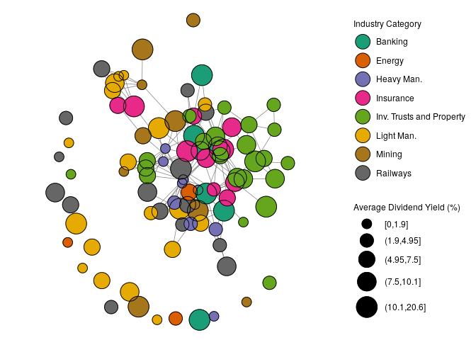

Materials for Reproduction
--------------------------

This repository contains the data and code to reproduce the tables and
figures in Rui Esteves and Gabriel Geisler Mesevage, “Social Networks in
Economic History: Opportunities and Challenges.” This document is
designed to be self-contained. Researchers can clone this repository and
open the `.Rmd` file to follow the production of the tables and figures
interactively. Alternatively, the file `scotland_eda.R` is a stand-alone
file with R-code that produces each figure and table contained in the
paper.

In the sections below, we include a more interactive code through for
the production of the tables and figures.

### Loading the data and network summary statistics

``` r
library(Hmisc)
library(tidyverse)
library(igraph)

sc <- mdb.get("data/Scotland.mdb")

# Break database into constituent dataframes
list2env(sc, envir = globalenv())
```

    ## <environment: R_GlobalEnv>

``` r
# we create a company-by-director matrix
c_d <- as.matrix(table(Affiliations$CompId, Affiliations$DirId))

# The matrix product yields a company by company adjacency matrix
c_c <- c_d %*% t(c_d)

# we create an igraph object from the adjacency matrix,
# the graph is undirected and without self-loops
cg <- graph_from_adjacency_matrix(c_c, mode = 'directed', diag = F)

# Read in company attribute data
imm <- readxl::read_xlsx("data/data_imm.xlsx")

# First add in unconnected nodes
cons <- get.edgelist(cg)
cg <- graph_from_data_frame(cons, directed = FALSE, vertices = imm$compid)
cg <- simplify(cg)

# Now extract adjacency matrix
adjmat <- get.adjacency(cg, sparse = F)

# Now do eigen cent first
imm$eig_cent <- eigen_centrality(cg)$vector
imm$degree <- degree(cg)
imm$betweenness <- betweenness(cg)

#########################
# Network Summary Stats #
#########################

# density
edge_density(cg)
```

    ## [1] 0.04776739

``` r
# diameter
diameter(cg)
```

    ## [1] 7

``` r
# shortest paths
dmat <- shortest.paths(cg) # unreachable nodes are Inf
dmat <- dmat[lower.tri(dmat)]
dmat <- dmat[is.finite(dmat)]

# Mean shortest path
mean(dmat)
```

    ## [1] 2.899672

``` r
# Shortest path standard deviation
sd(dmat)
```

    ## [1] 1.057052

``` r
# Max shortest path (same as diameter)
max(dmat)
```

    ## [1] 7

``` r
# Degrees
degrees <- degree(cg)
# Mean degree
mean(degrees)
```

    ## [1] 5.111111

``` r
degree.df <- data.frame(degree = degrees, names = V(cg)$name)

degree.df %>% group_by(degree) %>% summarise(N = n(), Freq. = N/nrow(degree.df)) %>%
  ungroup() %>% mutate(`Percent Cum.` = cumsum(Freq.)*100)
```

    ## # A tibble: 18 x 4
    ##    degree     N   Freq. `Percent Cum.`
    ##     <dbl> <int>   <dbl>          <dbl>
    ##  1      0    16 0.148             14.8
    ##  2      1    11 0.102             25  
    ##  3      2    13 0.120             37.0
    ##  4      3     6 0.0556            42.6
    ##  5      4     8 0.0741            50  
    ##  6      5    12 0.111             61.1
    ##  7      6     8 0.0741            68.5
    ##  8      7     7 0.0648            75  
    ##  9      8     6 0.0556            80.6
    ## 10      9     4 0.0370            84.3
    ## 11     10     4 0.0370            88.0
    ## 12     11     4 0.0370            91.7
    ## 13     12     2 0.0185            93.5
    ## 14     13     1 0.00926           94.4
    ## 15     14     3 0.0278            97.2
    ## 16     17     1 0.00926           98.1
    ## 17     18     1 0.00926           99.1
    ## 18     26     1 0.00926          100

``` r
# Top ten comps by degree
degree.df %>% arrange(-degree) %>% head(10L)
```

    ##    degree names
    ## 1      26     2
    ## 2      18    76
    ## 3      17    71
    ## 4      14     1
    ## 5      14    53
    ## 6      14    73
    ## 7      13    17
    ## 8      12    33
    ## 9      12    69
    ## 10     11     4

``` r
degree.df %>% mutate(upper.20 = degree >= quantile(degree, .8),
                     lower.20 = degree <= quantile(degree, .2)) %>%
  summarise(`Perc. Upper Quantile` = sum(degree[upper.20]/sum(degree)),
            `Perc. Lower Quantile` = sum(degree[lower.20]/sum(degree)))
```

    ##   Perc. Upper Quantile Perc. Lower Quantile
    ## 1             0.557971           0.01992754

The above summary statistics underpin the discussion of common empirical
network characteristics as discussed in section 2 of the paper. We can
also visualize and inspect the network.

### Visualizing the network

``` r
###########################
# Visualizing the Network #
###########################
# Set attributes
vid <- V(cg)$name
V(cg)$name <- as.character(Company$Company[as.character(Company$CompId) %in% vid])
V(cg)$ind <- Company$IndID[as.character(Company$CompId) %in% vid]
V(cg)$cap <- as.numeric(Company$Capital[as.character(Company$CompId) %in% vid])
V(cg)$prof <- as.numeric(imm$avg_div[as.character(imm$compid) %in% vid])

library(GGally)
library(intergraph)
library(RColorBrewer)

# use industrial categories
indcat <- data.frame(IndID = V(cg)$ind)
indcat <- left_join(indcat, Industry)

cat_cat <- c("Mining", "Heavy Man.", "Railways", "Energy", "Light Man.", 
             "Banking", "Insurance", "Inv. Trusts and Property")
indcat$IndCat <- factor(indcat$IndCat)
levels(indcat$IndCat) <- cat_cat

V(cg)$indcat <- as.character(indcat$IndCat)

ggnet2(simplify(cg), mode = 'fruchtermanreingold', layout.exp = .3,
       size = "prof", size.legend = "Average Dividend Yield (%)", size.cut = 5, max_size = 10,
       color = "indcat", 
       fill = "indcat",
       palette = "Greys", 
       color.legend = "Industry Category", 
       na.rm = "prof"
       ) +
  geom_point(aes(size = size), shape = 21, color = "black") + 
  guides(color = guide_legend(override.aes = 
                                list(shape=21, 
                                     size=10, 
                                     fill=brewer.pal(8, "Greys"), 
                                     color = "black")))
```



### Estimating network regressions

To estimate the regressions we use the packages `spdep` and `sphet`
which were written for spatial econometrics, and we output the results
using the package `texreg`. In this example we output the tables to
html. In the paper they are output to latex, and we edit them slightly
(removing the fixed effects) in order to truncate them for publication.

``` r
##################################
# Estimations of Network effects #
##################################

library(sphet)
library(spdep)
library(texreg)

###################################################
# Comparing centrality measures vs autoregression #
###################################################

source("extract_helper_functions.R")

# we build a helper function to cope with missing observations
# when running network econometric models
run_regs <- function(formula, depvar, type = "stsls", adjmat) {

  # get data
  dat <- na.omit(imm[, all.vars(formula)])
  
  # get indices of full obs
  ind <- rowSums(is.na(imm[, all.vars(formula)])) == 0
  
  # build weight matrix
  W <- mat2listw(adjmat[ind, ind], style = "W")
  
  if (type == "stsls") {
    sts <- stsls(formula, data = dat, listw = W, zero.policy = TRUE)
    sts$rsquared <- 1 - sts$sse/(nrow(dat) * var(dat[, all.vars(formula)[1]]))
  } else if (type == "gstsls") {
    sts <- gstslshet(formula, data = dat, listw = W, zero.policy = TRUE)
  } else if (type == "sacsarlm") {
    sts <- sacsarlm(formula, data = dat, listw = W, Durbin = TRUE, zero.policy = TRUE)
  } else if (type == "lagsarlm") {
    sts <- lagsarlm(formula, data = dat, listw = W, Durbin = TRUE, zero.policy = TRUE)
  } else {
    cat("Unknown regression type!")
  }
  
  sts
}

# Create industry dummies
imm$railways <- as.numeric(imm$indid == 5)
imm$insurance <- as.numeric(imm$indid == 23)
imm$investment <- as.numeric(imm$indid == 24)
imm$banking <- as.numeric(imm$indid == 22)

lm2 <- lm(avg_div ~ degree + betweenness + eig_cent + capital + qualifications  + uncalled, data = imm)
sts2 <- run_regs(avg_div ~ capital + qualifications  + uncalled, imm$avg_div, type = "stsls", adjmat = adjmat)
gsts2 <- run_regs(avg_div ~ capital + qualifications  + uncalled, imm$avg_div, type = "gstsls", adjmat = adjmat)
sacsarlm2 <- run_regs(avg_div ~ capital + qualifications  + uncalled, imm$avg_div, type = "sacsarlm", adjmat = adjmat)
lm3 <- lm(avg_div ~ degree + betweenness + eig_cent + capital + qualifications + uncalled + railways + insurance + investment + banking, 
               data = imm[!is.na(imm$avg_div), ])
sts3 <- run_regs(avg_div ~ capital + qualifications  + uncalled + 
                   railways + insurance + investment + banking, imm$avg_div, type = "stsls", adjmat = adjmat)
gsts3 <- run_regs(avg_div ~ capital + qualifications  + uncalled + 
                    railways + insurance + investment + banking, imm$avg_div, type = "gstsls", adjmat = adjmat)
sacsarlm3 <- run_regs(avg_div ~ capital + qualifications  + uncalled + 
                        railways + insurance + investment + banking, imm$avg_div, type = "sacsarlm", adjmat = adjmat)


htmlreg(list(lm2, extract.stsls(sts2), extract.gstslshet(gsts2), sacsarlm2,
            lm3, extract.stsls(sts3), extract.gstslshet(gsts3), sacsarlm3), 
       custom.model.names = c("OLS", "STSLS", "GSTSLS", "SAC/SARAR", "OLS", "STSLS", "GSTSLS", "SAC/SARAR"))
```

&lt;!DOCTYPE HTML PUBLIC “-//W3C//DTD HTML 4.01 Transitional//EN”
“<a href="http://www.w3.org/TR/html4/loose.dtd" class="uri">http://www.w3.org/TR/html4/loose.dtd</a>”&gt;
<table cellspacing="0" align="center" style="border: none;">
<caption align="bottom" style="margin-top:0.3em;">
Statistical models
</caption>
<tr>
<th style="text-align: left; border-top: 2px solid black; border-bottom: 1px solid black; padding-right: 12px;">
<b></b>
</th>
<th style="text-align: left; border-top: 2px solid black; border-bottom: 1px solid black; padding-right: 12px;">
<b>OLS</b>
</th>
<th style="text-align: left; border-top: 2px solid black; border-bottom: 1px solid black; padding-right: 12px;">
<b>STSLS</b>
</th>
<th style="text-align: left; border-top: 2px solid black; border-bottom: 1px solid black; padding-right: 12px;">
<b>GSTSLS</b>
</th>
<th style="text-align: left; border-top: 2px solid black; border-bottom: 1px solid black; padding-right: 12px;">
<b>SAC/SARAR</b>
</th>
<th style="text-align: left; border-top: 2px solid black; border-bottom: 1px solid black; padding-right: 12px;">
<b>OLS</b>
</th>
<th style="text-align: left; border-top: 2px solid black; border-bottom: 1px solid black; padding-right: 12px;">
<b>STSLS</b>
</th>
<th style="text-align: left; border-top: 2px solid black; border-bottom: 1px solid black; padding-right: 12px;">
<b>GSTSLS</b>
</th>
<th style="text-align: left; border-top: 2px solid black; border-bottom: 1px solid black; padding-right: 12px;">
<b>SAC/SARAR</b>
</th>
</tr>
<tr>
<td style="padding-right: 12px; border: none;">
(Intercept)
</td>
<td style="padding-right: 12px; border: none;">
5.56<sup style="vertical-align: 0px;">\*\*\*</sup>
</td>
<td style="padding-right: 12px; border: none;">
4.45<sup style="vertical-align: 0px;">\*\*\*</sup>
</td>
<td style="padding-right: 12px; border: none;">
3.92<sup style="vertical-align: 0px;">\*\*\*</sup>
</td>
<td style="padding-right: 12px; border: none;">
3.81<sup style="vertical-align: 0px;">\*\*\*</sup>
</td>
<td style="padding-right: 12px; border: none;">
6.13<sup style="vertical-align: 0px;">\*\*\*</sup>
</td>
<td style="padding-right: 12px; border: none;">
4.63<sup style="vertical-align: 0px;">\*\*\*</sup>
</td>
<td style="padding-right: 12px; border: none;">
4.26<sup style="vertical-align: 0px;">\*\*\*</sup>
</td>
<td style="padding-right: 12px; border: none;">
4.14<sup style="vertical-align: 0px;">\*\*\*</sup>
</td>
</tr>
<tr>
<td style="padding-right: 12px; border: none;">
</td>
<td style="padding-right: 12px; border: none;">
(0.93)
</td>
<td style="padding-right: 12px; border: none;">
(1.20)
</td>
<td style="padding-right: 12px; border: none;">
(1.02)
</td>
<td style="padding-right: 12px; border: none;">
(0.85)
</td>
<td style="padding-right: 12px; border: none;">
(0.88)
</td>
<td style="padding-right: 12px; border: none;">
(1.02)
</td>
<td style="padding-right: 12px; border: none;">
(0.83)
</td>
<td style="padding-right: 12px; border: none;">
(0.82)
</td>
</tr>
<tr>
<td style="padding-right: 12px; border: none;">
degree
</td>
<td style="padding-right: 12px; border: none;">
0.23
</td>
<td style="padding-right: 12px; border: none;">
</td>
<td style="padding-right: 12px; border: none;">
</td>
<td style="padding-right: 12px; border: none;">
</td>
<td style="padding-right: 12px; border: none;">
0.10
</td>
<td style="padding-right: 12px; border: none;">
</td>
<td style="padding-right: 12px; border: none;">
</td>
<td style="padding-right: 12px; border: none;">
</td>
</tr>
<tr>
<td style="padding-right: 12px; border: none;">
</td>
<td style="padding-right: 12px; border: none;">
(0.31)
</td>
<td style="padding-right: 12px; border: none;">
</td>
<td style="padding-right: 12px; border: none;">
</td>
<td style="padding-right: 12px; border: none;">
</td>
<td style="padding-right: 12px; border: none;">
(0.30)
</td>
<td style="padding-right: 12px; border: none;">
</td>
<td style="padding-right: 12px; border: none;">
</td>
<td style="padding-right: 12px; border: none;">
</td>
</tr>
<tr>
<td style="padding-right: 12px; border: none;">
betweenness
</td>
<td style="padding-right: 12px; border: none;">
-0.00
</td>
<td style="padding-right: 12px; border: none;">
</td>
<td style="padding-right: 12px; border: none;">
</td>
<td style="padding-right: 12px; border: none;">
</td>
<td style="padding-right: 12px; border: none;">
0.00
</td>
<td style="padding-right: 12px; border: none;">
</td>
<td style="padding-right: 12px; border: none;">
</td>
<td style="padding-right: 12px; border: none;">
</td>
</tr>
<tr>
<td style="padding-right: 12px; border: none;">
</td>
<td style="padding-right: 12px; border: none;">
(0.01)
</td>
<td style="padding-right: 12px; border: none;">
</td>
<td style="padding-right: 12px; border: none;">
</td>
<td style="padding-right: 12px; border: none;">
</td>
<td style="padding-right: 12px; border: none;">
(0.01)
</td>
<td style="padding-right: 12px; border: none;">
</td>
<td style="padding-right: 12px; border: none;">
</td>
<td style="padding-right: 12px; border: none;">
</td>
</tr>
<tr>
<td style="padding-right: 12px; border: none;">
eig\_cent
</td>
<td style="padding-right: 12px; border: none;">
-0.45
</td>
<td style="padding-right: 12px; border: none;">
</td>
<td style="padding-right: 12px; border: none;">
</td>
<td style="padding-right: 12px; border: none;">
</td>
<td style="padding-right: 12px; border: none;">
1.49
</td>
<td style="padding-right: 12px; border: none;">
</td>
<td style="padding-right: 12px; border: none;">
</td>
<td style="padding-right: 12px; border: none;">
</td>
</tr>
<tr>
<td style="padding-right: 12px; border: none;">
</td>
<td style="padding-right: 12px; border: none;">
(5.12)
</td>
<td style="padding-right: 12px; border: none;">
</td>
<td style="padding-right: 12px; border: none;">
</td>
<td style="padding-right: 12px; border: none;">
</td>
<td style="padding-right: 12px; border: none;">
(4.83)
</td>
<td style="padding-right: 12px; border: none;">
</td>
<td style="padding-right: 12px; border: none;">
</td>
<td style="padding-right: 12px; border: none;">
</td>
</tr>
<tr>
<td style="padding-right: 12px; border: none;">
capital
</td>
<td style="padding-right: 12px; border: none;">
-0.00
</td>
<td style="padding-right: 12px; border: none;">
0.00
</td>
<td style="padding-right: 12px; border: none;">
-0.00
</td>
<td style="padding-right: 12px; border: none;">
0.00
</td>
<td style="padding-right: 12px; border: none;">
-0.00
</td>
<td style="padding-right: 12px; border: none;">
0.00
</td>
<td style="padding-right: 12px; border: none;">
0.00
</td>
<td style="padding-right: 12px; border: none;">
0.00
</td>
</tr>
<tr>
<td style="padding-right: 12px; border: none;">
</td>
<td style="padding-right: 12px; border: none;">
(0.00)
</td>
<td style="padding-right: 12px; border: none;">
(0.00)
</td>
<td style="padding-right: 12px; border: none;">
(0.00)
</td>
<td style="padding-right: 12px; border: none;">
(0.00)
</td>
<td style="padding-right: 12px; border: none;">
(0.00)
</td>
<td style="padding-right: 12px; border: none;">
(0.00)
</td>
<td style="padding-right: 12px; border: none;">
(0.00)
</td>
<td style="padding-right: 12px; border: none;">
(0.00)
</td>
</tr>
<tr>
<td style="padding-right: 12px; border: none;">
qualifications
</td>
<td style="padding-right: 12px; border: none;">
-0.07
</td>
<td style="padding-right: 12px; border: none;">
-0.08
</td>
<td style="padding-right: 12px; border: none;">
-0.09
</td>
<td style="padding-right: 12px; border: none;">
-0.08
</td>
<td style="padding-right: 12px; border: none;">
-0.12
</td>
<td style="padding-right: 12px; border: none;">
-0.11
</td>
<td style="padding-right: 12px; border: none;">
-0.10
</td>
<td style="padding-right: 12px; border: none;">
-0.16
</td>
</tr>
<tr>
<td style="padding-right: 12px; border: none;">
</td>
<td style="padding-right: 12px; border: none;">
(0.15)
</td>
<td style="padding-right: 12px; border: none;">
(0.14)
</td>
<td style="padding-right: 12px; border: none;">
(0.07)
</td>
<td style="padding-right: 12px; border: none;">
(0.13)
</td>
<td style="padding-right: 12px; border: none;">
(0.15)
</td>
<td style="padding-right: 12px; border: none;">
(0.14)
</td>
<td style="padding-right: 12px; border: none;">
(0.09)
</td>
<td style="padding-right: 12px; border: none;">
(0.13)
</td>
</tr>
<tr>
<td style="padding-right: 12px; border: none;">
uncalled
</td>
<td style="padding-right: 12px; border: none;">
0.65<sup style="vertical-align: 0px;">\*</sup>
</td>
<td style="padding-right: 12px; border: none;">
0.63<sup style="vertical-align: 0px;">\*</sup>
</td>
<td style="padding-right: 12px; border: none;">
0.63<sup style="vertical-align: 0px;">\*\*\*</sup>
</td>
<td style="padding-right: 12px; border: none;">
0.62<sup style="vertical-align: 0px;">\*</sup>
</td>
<td style="padding-right: 12px; border: none;">
0.34
</td>
<td style="padding-right: 12px; border: none;">
0.36
</td>
<td style="padding-right: 12px; border: none;">
0.41<sup style="vertical-align: 0px;">\*</sup>
</td>
<td style="padding-right: 12px; border: none;">
0.28
</td>
</tr>
<tr>
<td style="padding-right: 12px; border: none;">
</td>
<td style="padding-right: 12px; border: none;">
(0.28)
</td>
<td style="padding-right: 12px; border: none;">
(0.28)
</td>
<td style="padding-right: 12px; border: none;">
(0.15)
</td>
<td style="padding-right: 12px; border: none;">
(0.26)
</td>
<td style="padding-right: 12px; border: none;">
(0.32)
</td>
<td style="padding-right: 12px; border: none;">
(0.32)
</td>
<td style="padding-right: 12px; border: none;">
(0.18)
</td>
<td style="padding-right: 12px; border: none;">
(0.29)
</td>
</tr>
<tr>
<td style="padding-right: 12px; border: none;">
Rho
</td>
<td style="padding-right: 12px; border: none;">
</td>
<td style="padding-right: 12px; border: none;">
0.33
</td>
<td style="padding-right: 12px; border: none;">
</td>
<td style="padding-right: 12px; border: none;">
</td>
<td style="padding-right: 12px; border: none;">
</td>
<td style="padding-right: 12px; border: none;">
0.40<sup style="vertical-align: 0px;">\*\*</sup>
</td>
<td style="padding-right: 12px; border: none;">
</td>
<td style="padding-right: 12px; border: none;">
</td>
</tr>
<tr>
<td style="padding-right: 12px; border: none;">
</td>
<td style="padding-right: 12px; border: none;">
</td>
<td style="padding-right: 12px; border: none;">
(0.17)
</td>
<td style="padding-right: 12px; border: none;">
</td>
<td style="padding-right: 12px; border: none;">
</td>
<td style="padding-right: 12px; border: none;">
</td>
<td style="padding-right: 12px; border: none;">
(0.14)
</td>
<td style="padding-right: 12px; border: none;">
</td>
<td style="padding-right: 12px; border: none;">
</td>
</tr>
<tr>
<td style="padding-right: 12px; border: none;">
rho
</td>
<td style="padding-right: 12px; border: none;">
</td>
<td style="padding-right: 12px; border: none;">
</td>
<td style="padding-right: 12px; border: none;">
0.43<sup style="vertical-align: 0px;">\*\*\*</sup>
</td>
<td style="padding-right: 12px; border: none;">
0.61<sup style="vertical-align: 0px;">\*\*\*</sup>
</td>
<td style="padding-right: 12px; border: none;">
</td>
<td style="padding-right: 12px; border: none;">
</td>
<td style="padding-right: 12px; border: none;">
0.51<sup style="vertical-align: 0px;">\*\*\*</sup>
</td>
<td style="padding-right: 12px; border: none;">
0.58<sup style="vertical-align: 0px;">\*\*\*</sup>
</td>
</tr>
<tr>
<td style="padding-right: 12px; border: none;">
</td>
<td style="padding-right: 12px; border: none;">
</td>
<td style="padding-right: 12px; border: none;">
</td>
<td style="padding-right: 12px; border: none;">
(0.13)
</td>
<td style="padding-right: 12px; border: none;">
(0.10)
</td>
<td style="padding-right: 12px; border: none;">
</td>
<td style="padding-right: 12px; border: none;">
</td>
<td style="padding-right: 12px; border: none;">
(0.12)
</td>
<td style="padding-right: 12px; border: none;">
(0.10)
</td>
</tr>
<tr>
<td style="padding-right: 12px; border: none;">
lambda
</td>
<td style="padding-right: 12px; border: none;">
</td>
<td style="padding-right: 12px; border: none;">
</td>
<td style="padding-right: 12px; border: none;">
-0.49<sup style="vertical-align: 0px;">\*\*</sup>
</td>
<td style="padding-right: 12px; border: none;">
-0.73<sup style="vertical-align: 0px;">\*\*\*</sup>
</td>
<td style="padding-right: 12px; border: none;">
</td>
<td style="padding-right: 12px; border: none;">
</td>
<td style="padding-right: 12px; border: none;">
-0.59<sup style="vertical-align: 0px;">\*\*</sup>
</td>
<td style="padding-right: 12px; border: none;">
-0.67<sup style="vertical-align: 0px;">\*\*\*</sup>
</td>
</tr>
<tr>
<td style="padding-right: 12px; border: none;">
</td>
<td style="padding-right: 12px; border: none;">
</td>
<td style="padding-right: 12px; border: none;">
</td>
<td style="padding-right: 12px; border: none;">
(0.18)
</td>
<td style="padding-right: 12px; border: none;">
(0.12)
</td>
<td style="padding-right: 12px; border: none;">
</td>
<td style="padding-right: 12px; border: none;">
</td>
<td style="padding-right: 12px; border: none;">
(0.19)
</td>
<td style="padding-right: 12px; border: none;">
(0.14)
</td>
</tr>
<tr>
<td style="padding-right: 12px; border: none;">
lag.capital
</td>
<td style="padding-right: 12px; border: none;">
</td>
<td style="padding-right: 12px; border: none;">
</td>
<td style="padding-right: 12px; border: none;">
</td>
<td style="padding-right: 12px; border: none;">
-0.00
</td>
<td style="padding-right: 12px; border: none;">
</td>
<td style="padding-right: 12px; border: none;">
</td>
<td style="padding-right: 12px; border: none;">
</td>
<td style="padding-right: 12px; border: none;">
-0.00
</td>
</tr>
<tr>
<td style="padding-right: 12px; border: none;">
</td>
<td style="padding-right: 12px; border: none;">
</td>
<td style="padding-right: 12px; border: none;">
</td>
<td style="padding-right: 12px; border: none;">
</td>
<td style="padding-right: 12px; border: none;">
(0.00)
</td>
<td style="padding-right: 12px; border: none;">
</td>
<td style="padding-right: 12px; border: none;">
</td>
<td style="padding-right: 12px; border: none;">
</td>
<td style="padding-right: 12px; border: none;">
(0.00)
</td>
</tr>
<tr>
<td style="padding-right: 12px; border: none;">
lag.qualifications
</td>
<td style="padding-right: 12px; border: none;">
</td>
<td style="padding-right: 12px; border: none;">
</td>
<td style="padding-right: 12px; border: none;">
</td>
<td style="padding-right: 12px; border: none;">
-0.17
</td>
<td style="padding-right: 12px; border: none;">
</td>
<td style="padding-right: 12px; border: none;">
</td>
<td style="padding-right: 12px; border: none;">
</td>
<td style="padding-right: 12px; border: none;">
0.13
</td>
</tr>
<tr>
<td style="padding-right: 12px; border: none;">
</td>
<td style="padding-right: 12px; border: none;">
</td>
<td style="padding-right: 12px; border: none;">
</td>
<td style="padding-right: 12px; border: none;">
</td>
<td style="padding-right: 12px; border: none;">
(0.22)
</td>
<td style="padding-right: 12px; border: none;">
</td>
<td style="padding-right: 12px; border: none;">
</td>
<td style="padding-right: 12px; border: none;">
</td>
<td style="padding-right: 12px; border: none;">
(0.29)
</td>
</tr>
<tr>
<td style="padding-right: 12px; border: none;">
lag.uncalled
</td>
<td style="padding-right: 12px; border: none;">
</td>
<td style="padding-right: 12px; border: none;">
</td>
<td style="padding-right: 12px; border: none;">
</td>
<td style="padding-right: 12px; border: none;">
0.01
</td>
<td style="padding-right: 12px; border: none;">
</td>
<td style="padding-right: 12px; border: none;">
</td>
<td style="padding-right: 12px; border: none;">
</td>
<td style="padding-right: 12px; border: none;">
0.54
</td>
</tr>
<tr>
<td style="padding-right: 12px; border: none;">
</td>
<td style="padding-right: 12px; border: none;">
</td>
<td style="padding-right: 12px; border: none;">
</td>
<td style="padding-right: 12px; border: none;">
</td>
<td style="padding-right: 12px; border: none;">
(0.44)
</td>
<td style="padding-right: 12px; border: none;">
</td>
<td style="padding-right: 12px; border: none;">
</td>
<td style="padding-right: 12px; border: none;">
</td>
<td style="padding-right: 12px; border: none;">
(0.55)
</td>
</tr>
<tr>
<td style="padding-right: 12px; border: none;">
railways
</td>
<td style="padding-right: 12px; border: none;">
</td>
<td style="padding-right: 12px; border: none;">
</td>
<td style="padding-right: 12px; border: none;">
</td>
<td style="padding-right: 12px; border: none;">
</td>
<td style="padding-right: 12px; border: none;">
-5.60<sup style="vertical-align: 0px;">\*\*</sup>
</td>
<td style="padding-right: 12px; border: none;">
-6.00<sup style="vertical-align: 0px;">\*\*</sup>
</td>
<td style="padding-right: 12px; border: none;">
-6.44<sup style="vertical-align: 0px;">\*\*\*</sup>
</td>
<td style="padding-right: 12px; border: none;">
-6.60<sup style="vertical-align: 0px;">\*\*</sup>
</td>
</tr>
<tr>
<td style="padding-right: 12px; border: none;">
</td>
<td style="padding-right: 12px; border: none;">
</td>
<td style="padding-right: 12px; border: none;">
</td>
<td style="padding-right: 12px; border: none;">
</td>
<td style="padding-right: 12px; border: none;">
</td>
<td style="padding-right: 12px; border: none;">
(2.06)
</td>
<td style="padding-right: 12px; border: none;">
(2.03)
</td>
<td style="padding-right: 12px; border: none;">
(1.21)
</td>
<td style="padding-right: 12px; border: none;">
(2.05)
</td>
</tr>
<tr>
<td style="padding-right: 12px; border: none;">
insurance
</td>
<td style="padding-right: 12px; border: none;">
</td>
<td style="padding-right: 12px; border: none;">
</td>
<td style="padding-right: 12px; border: none;">
</td>
<td style="padding-right: 12px; border: none;">
</td>
<td style="padding-right: 12px; border: none;">
1.75
</td>
<td style="padding-right: 12px; border: none;">
0.29
</td>
<td style="padding-right: 12px; border: none;">
-0.66
</td>
<td style="padding-right: 12px; border: none;">
1.78
</td>
</tr>
<tr>
<td style="padding-right: 12px; border: none;">
</td>
<td style="padding-right: 12px; border: none;">
</td>
<td style="padding-right: 12px; border: none;">
</td>
<td style="padding-right: 12px; border: none;">
</td>
<td style="padding-right: 12px; border: none;">
</td>
<td style="padding-right: 12px; border: none;">
(2.97)
</td>
<td style="padding-right: 12px; border: none;">
(2.98)
</td>
<td style="padding-right: 12px; border: none;">
(2.56)
</td>
<td style="padding-right: 12px; border: none;">
(2.85)
</td>
</tr>
<tr>
<td style="padding-right: 12px; border: none;">
investment
</td>
<td style="padding-right: 12px; border: none;">
</td>
<td style="padding-right: 12px; border: none;">
</td>
<td style="padding-right: 12px; border: none;">
</td>
<td style="padding-right: 12px; border: none;">
</td>
<td style="padding-right: 12px; border: none;">
-0.63
</td>
<td style="padding-right: 12px; border: none;">
-1.33
</td>
<td style="padding-right: 12px; border: none;">
-1.61
</td>
<td style="padding-right: 12px; border: none;">
-1.63
</td>
</tr>
<tr>
<td style="padding-right: 12px; border: none;">
</td>
<td style="padding-right: 12px; border: none;">
</td>
<td style="padding-right: 12px; border: none;">
</td>
<td style="padding-right: 12px; border: none;">
</td>
<td style="padding-right: 12px; border: none;">
</td>
<td style="padding-right: 12px; border: none;">
(1.35)
</td>
<td style="padding-right: 12px; border: none;">
(1.29)
</td>
<td style="padding-right: 12px; border: none;">
(0.93)
</td>
<td style="padding-right: 12px; border: none;">
(1.66)
</td>
</tr>
<tr>
<td style="padding-right: 12px; border: none;">
banking
</td>
<td style="padding-right: 12px; border: none;">
</td>
<td style="padding-right: 12px; border: none;">
</td>
<td style="padding-right: 12px; border: none;">
</td>
<td style="padding-right: 12px; border: none;">
</td>
<td style="padding-right: 12px; border: none;">
6.70<sup style="vertical-align: 0px;">\*\*</sup>
</td>
<td style="padding-right: 12px; border: none;">
6.76<sup style="vertical-align: 0px;">\*\*</sup>
</td>
<td style="padding-right: 12px; border: none;">
4.98<sup style="vertical-align: 0px;">\*\*\*</sup>
</td>
<td style="padding-right: 12px; border: none;">
6.04<sup style="vertical-align: 0px;">\*</sup>
</td>
</tr>
<tr>
<td style="padding-right: 12px; border: none;">
</td>
<td style="padding-right: 12px; border: none;">
</td>
<td style="padding-right: 12px; border: none;">
</td>
<td style="padding-right: 12px; border: none;">
</td>
<td style="padding-right: 12px; border: none;">
</td>
<td style="padding-right: 12px; border: none;">
(2.32)
</td>
<td style="padding-right: 12px; border: none;">
(2.24)
</td>
<td style="padding-right: 12px; border: none;">
(1.49)
</td>
<td style="padding-right: 12px; border: none;">
(2.45)
</td>
</tr>
<tr>
<td style="padding-right: 12px; border: none;">
lag.railways
</td>
<td style="padding-right: 12px; border: none;">
</td>
<td style="padding-right: 12px; border: none;">
</td>
<td style="padding-right: 12px; border: none;">
</td>
<td style="padding-right: 12px; border: none;">
</td>
<td style="padding-right: 12px; border: none;">
</td>
<td style="padding-right: 12px; border: none;">
</td>
<td style="padding-right: 12px; border: none;">
</td>
<td style="padding-right: 12px; border: none;">
2.68
</td>
</tr>
<tr>
<td style="padding-right: 12px; border: none;">
</td>
<td style="padding-right: 12px; border: none;">
</td>
<td style="padding-right: 12px; border: none;">
</td>
<td style="padding-right: 12px; border: none;">
</td>
<td style="padding-right: 12px; border: none;">
</td>
<td style="padding-right: 12px; border: none;">
</td>
<td style="padding-right: 12px; border: none;">
</td>
<td style="padding-right: 12px; border: none;">
</td>
<td style="padding-right: 12px; border: none;">
(3.41)
</td>
</tr>
<tr>
<td style="padding-right: 12px; border: none;">
lag.insurance
</td>
<td style="padding-right: 12px; border: none;">
</td>
<td style="padding-right: 12px; border: none;">
</td>
<td style="padding-right: 12px; border: none;">
</td>
<td style="padding-right: 12px; border: none;">
</td>
<td style="padding-right: 12px; border: none;">
</td>
<td style="padding-right: 12px; border: none;">
</td>
<td style="padding-right: 12px; border: none;">
</td>
<td style="padding-right: 12px; border: none;">
-6.37
</td>
</tr>
<tr>
<td style="padding-right: 12px; border: none;">
</td>
<td style="padding-right: 12px; border: none;">
</td>
<td style="padding-right: 12px; border: none;">
</td>
<td style="padding-right: 12px; border: none;">
</td>
<td style="padding-right: 12px; border: none;">
</td>
<td style="padding-right: 12px; border: none;">
</td>
<td style="padding-right: 12px; border: none;">
</td>
<td style="padding-right: 12px; border: none;">
</td>
<td style="padding-right: 12px; border: none;">
(6.61)
</td>
</tr>
<tr>
<td style="padding-right: 12px; border: none;">
lag.investment
</td>
<td style="padding-right: 12px; border: none;">
</td>
<td style="padding-right: 12px; border: none;">
</td>
<td style="padding-right: 12px; border: none;">
</td>
<td style="padding-right: 12px; border: none;">
</td>
<td style="padding-right: 12px; border: none;">
</td>
<td style="padding-right: 12px; border: none;">
</td>
<td style="padding-right: 12px; border: none;">
</td>
<td style="padding-right: 12px; border: none;">
0.35
</td>
</tr>
<tr>
<td style="padding-right: 12px; border: none;">
</td>
<td style="padding-right: 12px; border: none;">
</td>
<td style="padding-right: 12px; border: none;">
</td>
<td style="padding-right: 12px; border: none;">
</td>
<td style="padding-right: 12px; border: none;">
</td>
<td style="padding-right: 12px; border: none;">
</td>
<td style="padding-right: 12px; border: none;">
</td>
<td style="padding-right: 12px; border: none;">
</td>
<td style="padding-right: 12px; border: none;">
(2.35)
</td>
</tr>
<tr>
<td style="padding-right: 12px; border: none;">
lag.banking
</td>
<td style="padding-right: 12px; border: none;">
</td>
<td style="padding-right: 12px; border: none;">
</td>
<td style="padding-right: 12px; border: none;">
</td>
<td style="padding-right: 12px; border: none;">
</td>
<td style="padding-right: 12px; border: none;">
</td>
<td style="padding-right: 12px; border: none;">
</td>
<td style="padding-right: 12px; border: none;">
</td>
<td style="padding-right: 12px; border: none;">
-6.31
</td>
</tr>
<tr>
<td style="padding-right: 12px; border: none;">
</td>
<td style="padding-right: 12px; border: none;">
</td>
<td style="padding-right: 12px; border: none;">
</td>
<td style="padding-right: 12px; border: none;">
</td>
<td style="padding-right: 12px; border: none;">
</td>
<td style="padding-right: 12px; border: none;">
</td>
<td style="padding-right: 12px; border: none;">
</td>
<td style="padding-right: 12px; border: none;">
</td>
<td style="padding-right: 12px; border: none;">
(3.71)
</td>
</tr>
<tr>
<td style="border-top: 1px solid black;">
R<sup style="vertical-align: 0px;">2</sup>
</td>
<td style="border-top: 1px solid black;">
0.10
</td>
<td style="border-top: 1px solid black;">
0.10
</td>
<td style="border-top: 1px solid black;">
0.07
</td>
<td style="border-top: 1px solid black;">
</td>
<td style="border-top: 1px solid black;">
0.31
</td>
<td style="border-top: 1px solid black;">
0.32
</td>
<td style="border-top: 1px solid black;">
0.29
</td>
<td style="border-top: 1px solid black;">
</td>
</tr>
<tr>
<td style="padding-right: 12px; border: none;">
Adj. R<sup style="vertical-align: 0px;">2</sup>
</td>
<td style="padding-right: 12px; border: none;">
0.04
</td>
<td style="padding-right: 12px; border: none;">
</td>
<td style="padding-right: 12px; border: none;">
</td>
<td style="padding-right: 12px; border: none;">
</td>
<td style="padding-right: 12px; border: none;">
0.23
</td>
<td style="padding-right: 12px; border: none;">
</td>
<td style="padding-right: 12px; border: none;">
</td>
<td style="padding-right: 12px; border: none;">
</td>
</tr>
<tr>
<td style="padding-right: 12px; border: none;">
Num. obs.
</td>
<td style="padding-right: 12px; border: none;">
95
</td>
<td style="padding-right: 12px; border: none;">
95.00
</td>
<td style="padding-right: 12px; border: none;">
95.00
</td>
<td style="padding-right: 12px; border: none;">
95
</td>
<td style="padding-right: 12px; border: none;">
95
</td>
<td style="padding-right: 12px; border: none;">
95.00
</td>
<td style="padding-right: 12px; border: none;">
95.00
</td>
<td style="padding-right: 12px; border: none;">
95
</td>
</tr>
<tr>
<td style="padding-right: 12px; border: none;">
RMSE
</td>
<td style="padding-right: 12px; border: none;">
5.34
</td>
<td style="padding-right: 12px; border: none;">
</td>
<td style="padding-right: 12px; border: none;">
</td>
<td style="padding-right: 12px; border: none;">
</td>
<td style="padding-right: 12px; border: none;">
4.80
</td>
<td style="padding-right: 12px; border: none;">
</td>
<td style="padding-right: 12px; border: none;">
</td>
<td style="padding-right: 12px; border: none;">
</td>
</tr>
<tr>
<td style="padding-right: 12px; border: none;">
Parameters
</td>
<td style="padding-right: 12px; border: none;">
</td>
<td style="padding-right: 12px; border: none;">
</td>
<td style="padding-right: 12px; border: none;">
</td>
<td style="padding-right: 12px; border: none;">
10
</td>
<td style="padding-right: 12px; border: none;">
</td>
<td style="padding-right: 12px; border: none;">
</td>
<td style="padding-right: 12px; border: none;">
</td>
<td style="padding-right: 12px; border: none;">
18
</td>
</tr>
<tr>
<td style="padding-right: 12px; border: none;">
Log Likelihood
</td>
<td style="padding-right: 12px; border: none;">
</td>
<td style="padding-right: 12px; border: none;">
</td>
<td style="padding-right: 12px; border: none;">
</td>
<td style="padding-right: 12px; border: none;">
-284.64
</td>
<td style="padding-right: 12px; border: none;">
</td>
<td style="padding-right: 12px; border: none;">
</td>
<td style="padding-right: 12px; border: none;">
</td>
<td style="padding-right: 12px; border: none;">
-270.81
</td>
</tr>
<tr>
<td style="padding-right: 12px; border: none;">
AIC (Linear model)
</td>
<td style="padding-right: 12px; border: none;">
</td>
<td style="padding-right: 12px; border: none;">
</td>
<td style="padding-right: 12px; border: none;">
</td>
<td style="padding-right: 12px; border: none;">
592.68
</td>
<td style="padding-right: 12px; border: none;">
</td>
<td style="padding-right: 12px; border: none;">
</td>
<td style="padding-right: 12px; border: none;">
</td>
<td style="padding-right: 12px; border: none;">
576.88
</td>
</tr>
<tr>
<td style="padding-right: 12px; border: none;">
AIC (Spatial model)
</td>
<td style="padding-right: 12px; border: none;">
</td>
<td style="padding-right: 12px; border: none;">
</td>
<td style="padding-right: 12px; border: none;">
</td>
<td style="padding-right: 12px; border: none;">
589.29
</td>
<td style="padding-right: 12px; border: none;">
</td>
<td style="padding-right: 12px; border: none;">
</td>
<td style="padding-right: 12px; border: none;">
</td>
<td style="padding-right: 12px; border: none;">
577.61
</td>
</tr>
<tr>
<td style="padding-right: 12px; border: none;">
LR test: statistic
</td>
<td style="padding-right: 12px; border: none;">
</td>
<td style="padding-right: 12px; border: none;">
</td>
<td style="padding-right: 12px; border: none;">
</td>
<td style="padding-right: 12px; border: none;">
13.40
</td>
<td style="padding-right: 12px; border: none;">
</td>
<td style="padding-right: 12px; border: none;">
</td>
<td style="padding-right: 12px; border: none;">
</td>
<td style="padding-right: 12px; border: none;">
17.27
</td>
</tr>
<tr>
<td style="border-bottom: 2px solid black;">
LR test: p-value
</td>
<td style="border-bottom: 2px solid black;">
</td>
<td style="border-bottom: 2px solid black;">
</td>
<td style="border-bottom: 2px solid black;">
</td>
<td style="border-bottom: 2px solid black;">
0.02
</td>
<td style="border-bottom: 2px solid black;">
</td>
<td style="border-bottom: 2px solid black;">
</td>
<td style="border-bottom: 2px solid black;">
</td>
<td style="border-bottom: 2px solid black;">
0.04
</td>
</tr>
<tr>
<td style="padding-right: 12px; border: none;" colspan="10">
<span
style="font-size:0.8em"><sup style="vertical-align: 0px;">***</sup>p
&lt; 0.001, <sup style="vertical-align: 0px;">**</sup>p &lt; 0.01,
<sup style="vertical-align: 0px;">*</sup>p &lt; 0.05</span>
</td>
</tr>
</table>
Finally, we reproduce the results of Table 3 by creating a mis-measured
network which fails to encode connections between companies and banks
and re-estimating the regressions.

``` r
#######################################################
# Estimations of Network effects w/ Measurement Error #
#######################################################

cg2 <- cg %>% delete.edges(E(cg)[from(V(cg)[V(cg)$indcat=="Banking"])])

# Now extract adjacency matrix
adjmat_nb <- get.adjacency(cg2, sparse = F)

# Now do eigen cent first
#imm <- imm[imm$compid %in% names(V(cg)),]
imm$eig_cent_nb <- eigen_centrality(cg2)$vector
imm$degree_nb <- degree(cg2)
imm$betweenness_nb <- betweenness(cg2)

########################################################################
# Comparing centrality measures vs autoregression w/ Measurement Error #
########################################################################

# Make wide table
lm2_nb <- lm(avg_div ~ degree_nb + betweenness_nb + eig_cent_nb + capital + qualifications  + uncalled, data = imm)
sts2_nb <- run_regs(avg_div ~ capital + qualifications  + uncalled, imm$avg_div, type = "stsls", adjmat = adjmat_nb)
gsts2_nb <- run_regs(avg_div ~ capital + qualifications  + uncalled, imm$avg_div, type = "gstsls", adjmat = adjmat_nb)
sacsarlm2_nb <- run_regs(avg_div ~ capital + qualifications  + uncalled, imm$avg_div, type = "sacsarlm", adjmat = adjmat_nb)

htmlreg(list(lm2_nb, extract.stsls(sts2_nb), extract.gstslshet(gsts2_nb), sacsarlm2_nb), 
       custom.model.names = c("OLS", "STSLS", "GSTSLS", "SAC/SARAR"))
```

&lt;!DOCTYPE HTML PUBLIC “-//W3C//DTD HTML 4.01 Transitional//EN”
“<a href="http://www.w3.org/TR/html4/loose.dtd" class="uri">http://www.w3.org/TR/html4/loose.dtd</a>”&gt;
<table cellspacing="0" align="center" style="border: none;">
<caption align="bottom" style="margin-top:0.3em;">
Statistical models
</caption>
<tr>
<th style="text-align: left; border-top: 2px solid black; border-bottom: 1px solid black; padding-right: 12px;">
<b></b>
</th>
<th style="text-align: left; border-top: 2px solid black; border-bottom: 1px solid black; padding-right: 12px;">
<b>OLS</b>
</th>
<th style="text-align: left; border-top: 2px solid black; border-bottom: 1px solid black; padding-right: 12px;">
<b>STSLS</b>
</th>
<th style="text-align: left; border-top: 2px solid black; border-bottom: 1px solid black; padding-right: 12px;">
<b>GSTSLS</b>
</th>
<th style="text-align: left; border-top: 2px solid black; border-bottom: 1px solid black; padding-right: 12px;">
<b>SAC/SARAR</b>
</th>
</tr>
<tr>
<td style="padding-right: 12px; border: none;">
(Intercept)
</td>
<td style="padding-right: 12px; border: none;">
6.76<sup style="vertical-align: 0px;">\*\*\*</sup>
</td>
<td style="padding-right: 12px; border: none;">
6.61<sup style="vertical-align: 0px;">\*\*\*</sup>
</td>
<td style="padding-right: 12px; border: none;">
6.77<sup style="vertical-align: 0px;">\*\*\*</sup>
</td>
<td style="padding-right: 12px; border: none;">
6.06<sup style="vertical-align: 0px;">\*\*\*</sup>
</td>
</tr>
<tr>
<td style="padding-right: 12px; border: none;">
</td>
<td style="padding-right: 12px; border: none;">
(0.89)
</td>
<td style="padding-right: 12px; border: none;">
(1.11)
</td>
<td style="padding-right: 12px; border: none;">
(1.15)
</td>
<td style="padding-right: 12px; border: none;">
(1.05)
</td>
</tr>
<tr>
<td style="padding-right: 12px; border: none;">
degree\_nb
</td>
<td style="padding-right: 12px; border: none;">
-0.32
</td>
<td style="padding-right: 12px; border: none;">
</td>
<td style="padding-right: 12px; border: none;">
</td>
<td style="padding-right: 12px; border: none;">
</td>
</tr>
<tr>
<td style="padding-right: 12px; border: none;">
</td>
<td style="padding-right: 12px; border: none;">
(0.32)
</td>
<td style="padding-right: 12px; border: none;">
</td>
<td style="padding-right: 12px; border: none;">
</td>
<td style="padding-right: 12px; border: none;">
</td>
</tr>
<tr>
<td style="padding-right: 12px; border: none;">
betweenness\_nb
</td>
<td style="padding-right: 12px; border: none;">
-0.00
</td>
<td style="padding-right: 12px; border: none;">
</td>
<td style="padding-right: 12px; border: none;">
</td>
<td style="padding-right: 12px; border: none;">
</td>
</tr>
<tr>
<td style="padding-right: 12px; border: none;">
</td>
<td style="padding-right: 12px; border: none;">
(0.01)
</td>
<td style="padding-right: 12px; border: none;">
</td>
<td style="padding-right: 12px; border: none;">
</td>
<td style="padding-right: 12px; border: none;">
</td>
</tr>
<tr>
<td style="padding-right: 12px; border: none;">
eig\_cent\_nb
</td>
<td style="padding-right: 12px; border: none;">
5.24
</td>
<td style="padding-right: 12px; border: none;">
</td>
<td style="padding-right: 12px; border: none;">
</td>
<td style="padding-right: 12px; border: none;">
</td>
</tr>
<tr>
<td style="padding-right: 12px; border: none;">
</td>
<td style="padding-right: 12px; border: none;">
(4.74)
</td>
<td style="padding-right: 12px; border: none;">
</td>
<td style="padding-right: 12px; border: none;">
</td>
<td style="padding-right: 12px; border: none;">
</td>
</tr>
<tr>
<td style="padding-right: 12px; border: none;">
capital
</td>
<td style="padding-right: 12px; border: none;">
0.00
</td>
<td style="padding-right: 12px; border: none;">
0.00
</td>
<td style="padding-right: 12px; border: none;">
0.00
</td>
<td style="padding-right: 12px; border: none;">
0.00
</td>
</tr>
<tr>
<td style="padding-right: 12px; border: none;">
</td>
<td style="padding-right: 12px; border: none;">
(0.00)
</td>
<td style="padding-right: 12px; border: none;">
(0.00)
</td>
<td style="padding-right: 12px; border: none;">
(0.00)
</td>
<td style="padding-right: 12px; border: none;">
(0.00)
</td>
</tr>
<tr>
<td style="padding-right: 12px; border: none;">
qualifications
</td>
<td style="padding-right: 12px; border: none;">
-0.01
</td>
<td style="padding-right: 12px; border: none;">
-0.04
</td>
<td style="padding-right: 12px; border: none;">
-0.03
</td>
<td style="padding-right: 12px; border: none;">
-0.06
</td>
</tr>
<tr>
<td style="padding-right: 12px; border: none;">
</td>
<td style="padding-right: 12px; border: none;">
(0.15)
</td>
<td style="padding-right: 12px; border: none;">
(0.14)
</td>
<td style="padding-right: 12px; border: none;">
(0.07)
</td>
<td style="padding-right: 12px; border: none;">
(0.14)
</td>
</tr>
<tr>
<td style="padding-right: 12px; border: none;">
uncalled
</td>
<td style="padding-right: 12px; border: none;">
0.64<sup style="vertical-align: 0px;">\*</sup>
</td>
<td style="padding-right: 12px; border: none;">
0.66<sup style="vertical-align: 0px;">\*</sup>
</td>
<td style="padding-right: 12px; border: none;">
0.63<sup style="vertical-align: 0px;">\*\*\*</sup>
</td>
<td style="padding-right: 12px; border: none;">
0.68<sup style="vertical-align: 0px;">\*</sup>
</td>
</tr>
<tr>
<td style="padding-right: 12px; border: none;">
</td>
<td style="padding-right: 12px; border: none;">
(0.28)
</td>
<td style="padding-right: 12px; border: none;">
(0.28)
</td>
<td style="padding-right: 12px; border: none;">
(0.14)
</td>
<td style="padding-right: 12px; border: none;">
(0.27)
</td>
</tr>
<tr>
<td style="padding-right: 12px; border: none;">
Rho
</td>
<td style="padding-right: 12px; border: none;">
</td>
<td style="padding-right: 12px; border: none;">
-0.06
</td>
<td style="padding-right: 12px; border: none;">
</td>
<td style="padding-right: 12px; border: none;">
</td>
</tr>
<tr>
<td style="padding-right: 12px; border: none;">
</td>
<td style="padding-right: 12px; border: none;">
</td>
<td style="padding-right: 12px; border: none;">
(0.18)
</td>
<td style="padding-right: 12px; border: none;">
</td>
<td style="padding-right: 12px; border: none;">
</td>
</tr>
<tr>
<td style="padding-right: 12px; border: none;">
rho
</td>
<td style="padding-right: 12px; border: none;">
</td>
<td style="padding-right: 12px; border: none;">
</td>
<td style="padding-right: 12px; border: none;">
-0.09
</td>
<td style="padding-right: 12px; border: none;">
0.22
</td>
</tr>
<tr>
<td style="padding-right: 12px; border: none;">
</td>
<td style="padding-right: 12px; border: none;">
</td>
<td style="padding-right: 12px; border: none;">
</td>
<td style="padding-right: 12px; border: none;">
(0.17)
</td>
<td style="padding-right: 12px; border: none;">
(0.19)
</td>
</tr>
<tr>
<td style="padding-right: 12px; border: none;">
lambda
</td>
<td style="padding-right: 12px; border: none;">
</td>
<td style="padding-right: 12px; border: none;">
</td>
<td style="padding-right: 12px; border: none;">
0.15
</td>
<td style="padding-right: 12px; border: none;">
-0.25
</td>
</tr>
<tr>
<td style="padding-right: 12px; border: none;">
</td>
<td style="padding-right: 12px; border: none;">
</td>
<td style="padding-right: 12px; border: none;">
</td>
<td style="padding-right: 12px; border: none;">
(0.19)
</td>
<td style="padding-right: 12px; border: none;">
(0.25)
</td>
</tr>
<tr>
<td style="padding-right: 12px; border: none;">
lag.capital
</td>
<td style="padding-right: 12px; border: none;">
</td>
<td style="padding-right: 12px; border: none;">
</td>
<td style="padding-right: 12px; border: none;">
</td>
<td style="padding-right: 12px; border: none;">
-0.00
</td>
</tr>
<tr>
<td style="padding-right: 12px; border: none;">
</td>
<td style="padding-right: 12px; border: none;">
</td>
<td style="padding-right: 12px; border: none;">
</td>
<td style="padding-right: 12px; border: none;">
</td>
<td style="padding-right: 12px; border: none;">
(0.00)
</td>
</tr>
<tr>
<td style="padding-right: 12px; border: none;">
lag.qualifications
</td>
<td style="padding-right: 12px; border: none;">
</td>
<td style="padding-right: 12px; border: none;">
</td>
<td style="padding-right: 12px; border: none;">
</td>
<td style="padding-right: 12px; border: none;">
-0.23
</td>
</tr>
<tr>
<td style="padding-right: 12px; border: none;">
</td>
<td style="padding-right: 12px; border: none;">
</td>
<td style="padding-right: 12px; border: none;">
</td>
<td style="padding-right: 12px; border: none;">
</td>
<td style="padding-right: 12px; border: none;">
(0.25)
</td>
</tr>
<tr>
<td style="padding-right: 12px; border: none;">
lag.uncalled
</td>
<td style="padding-right: 12px; border: none;">
</td>
<td style="padding-right: 12px; border: none;">
</td>
<td style="padding-right: 12px; border: none;">
</td>
<td style="padding-right: 12px; border: none;">
0.27
</td>
</tr>
<tr>
<td style="padding-right: 12px; border: none;">
</td>
<td style="padding-right: 12px; border: none;">
</td>
<td style="padding-right: 12px; border: none;">
</td>
<td style="padding-right: 12px; border: none;">
</td>
<td style="padding-right: 12px; border: none;">
(0.48)
</td>
</tr>
<tr>
<td style="border-top: 1px solid black;">
R<sup style="vertical-align: 0px;">2</sup>
</td>
<td style="border-top: 1px solid black;">
0.10
</td>
<td style="border-top: 1px solid black;">
0.09
</td>
<td style="border-top: 1px solid black;">
0.08
</td>
<td style="border-top: 1px solid black;">
</td>
</tr>
<tr>
<td style="padding-right: 12px; border: none;">
Adj. R<sup style="vertical-align: 0px;">2</sup>
</td>
<td style="padding-right: 12px; border: none;">
0.04
</td>
<td style="padding-right: 12px; border: none;">
</td>
<td style="padding-right: 12px; border: none;">
</td>
<td style="padding-right: 12px; border: none;">
</td>
</tr>
<tr>
<td style="padding-right: 12px; border: none;">
Num. obs.
</td>
<td style="padding-right: 12px; border: none;">
95
</td>
<td style="padding-right: 12px; border: none;">
95.00
</td>
<td style="padding-right: 12px; border: none;">
95.00
</td>
<td style="padding-right: 12px; border: none;">
95
</td>
</tr>
<tr>
<td style="padding-right: 12px; border: none;">
RMSE
</td>
<td style="padding-right: 12px; border: none;">
5.34
</td>
<td style="padding-right: 12px; border: none;">
</td>
<td style="padding-right: 12px; border: none;">
</td>
<td style="padding-right: 12px; border: none;">
</td>
</tr>
<tr>
<td style="padding-right: 12px; border: none;">
Parameters
</td>
<td style="padding-right: 12px; border: none;">
</td>
<td style="padding-right: 12px; border: none;">
</td>
<td style="padding-right: 12px; border: none;">
</td>
<td style="padding-right: 12px; border: none;">
10
</td>
</tr>
<tr>
<td style="padding-right: 12px; border: none;">
Log Likelihood
</td>
<td style="padding-right: 12px; border: none;">
</td>
<td style="padding-right: 12px; border: none;">
</td>
<td style="padding-right: 12px; border: none;">
</td>
<td style="padding-right: 12px; border: none;">
-290.36
</td>
</tr>
<tr>
<td style="padding-right: 12px; border: none;">
AIC (Linear model)
</td>
<td style="padding-right: 12px; border: none;">
</td>
<td style="padding-right: 12px; border: none;">
</td>
<td style="padding-right: 12px; border: none;">
</td>
<td style="padding-right: 12px; border: none;">
592.68
</td>
</tr>
<tr>
<td style="padding-right: 12px; border: none;">
AIC (Spatial model)
</td>
<td style="padding-right: 12px; border: none;">
</td>
<td style="padding-right: 12px; border: none;">
</td>
<td style="padding-right: 12px; border: none;">
</td>
<td style="padding-right: 12px; border: none;">
600.72
</td>
</tr>
<tr>
<td style="padding-right: 12px; border: none;">
LR test: statistic
</td>
<td style="padding-right: 12px; border: none;">
</td>
<td style="padding-right: 12px; border: none;">
</td>
<td style="padding-right: 12px; border: none;">
</td>
<td style="padding-right: 12px; border: none;">
1.96
</td>
</tr>
<tr>
<td style="border-bottom: 2px solid black;">
LR test: p-value
</td>
<td style="border-bottom: 2px solid black;">
</td>
<td style="border-bottom: 2px solid black;">
</td>
<td style="border-bottom: 2px solid black;">
</td>
<td style="border-bottom: 2px solid black;">
0.85
</td>
</tr>
<tr>
<td style="padding-right: 12px; border: none;" colspan="6">
<span
style="font-size:0.8em"><sup style="vertical-align: 0px;">***</sup>p
&lt; 0.001, <sup style="vertical-align: 0px;">**</sup>p &lt; 0.01,
<sup style="vertical-align: 0px;">*</sup>p &lt; 0.05</span>
</td>
</tr>
</table>
